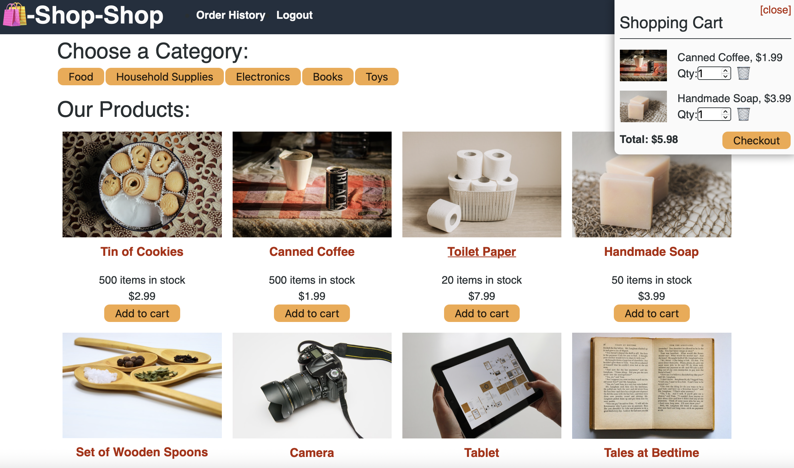

# redux-shop-shop

## Description
An e-commerce application called Shop-Shop that uses Redux to manage global state and handles secure online payments with a service called Stripe.

  ## Table of Contents

* [Installation](#installation)
* [Deployment](#deployment)
* [License](#license)
* [Mockup](#mockup)
* [Questions](#questions)

## Installation 
Clone the repo, run `npm i` to install the dependencies. 

To start the application, run from the root directory:
`npm start`. 

## Deployment
You can see the deployed Application [here](https://redux-shop-shop-liz.herokuapp.com).

## License

## Mockup

## Questions
If you have any questions about this project, send me an email at lizethariasc14@gmail.com or contact me through my [GitHub](https://github.com/lizariasc).